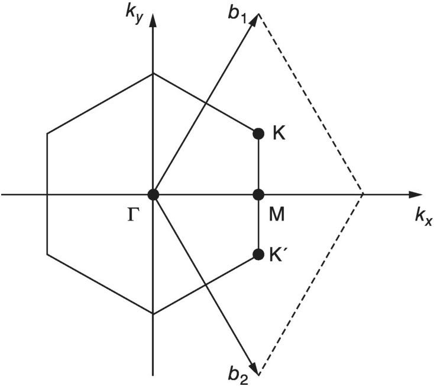

# Idea and Motivation

The goal of this project is to practise and learn how to use density functional theory(DFT). The motivation to find the bandstructure of graphene comes from a difficult practise question I did last term, in the tight-binding approximation.  
The main idea of DFT is that the ground-state properties of a many-electron system are uniquely determined by the electron density. This reduces the many-body problem of N electrons with 3N spatial coordinates down to three spatial coordinates.

# Theory

Due to Bloch's theorem, need to find reciprocal lattice vectors. Here I used for lattice vectors:

$a_1 = (\frac{\sqrt{3}}{2}a, \frac{1}{2}a)$

$a_2 = (\frac{\sqrt{3}}{2}a, -\frac{1}{2}a)$

and for the position of carbon atoms $(0, 0)$ and $(\frac{a}{\sqrt{3}}, 0)$, where $a=2.46$ angstroms. The reciprocal lattice vectors are then found. Note that this is the extent of defining the material in this code. This can be easily changed to make the bandstructure of another material. 

Now onto the main function to calculate the bandstructure. This is function of N, where N determines the number of lattice vectors that we include in the calculation. As such, increasing N should make the calculation more accurate. 

The function begins by modelling the potential of each atom with a gaussian. This is just to start the loop, which starts with the eigen energies attributed to the approximation, then as long as it hasn't converged to a constant value it calculates a new electron density, exchange potential and Hartree potential. The Hartree potential models how electrons are repelled by eachother according to Poisson's equation (this is classical), and the exchange potential accounts for Pauli exclusion, ie. it corrects the Hartree potential (this is quantum). [Link for exchange potential wikipedia with equation used.](https://en.wikipedia.org/wiki/Local-density_approximation)

Below is a diagram of graphene that includes the symmetry points of interest:

# Analysis

[Click here to view the interactive 3D Graphene Band Structure.](https://htmlpreview.github.io/?https://raw.githubusercontent.com/adammadill/Graphene-DFT/refs/heads/main/graphene_3d_bands.html)
